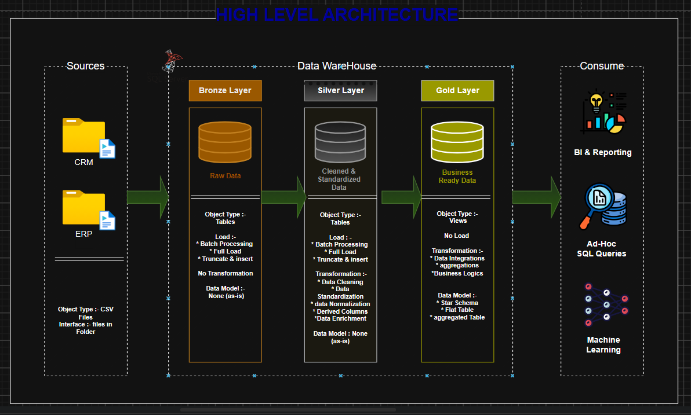
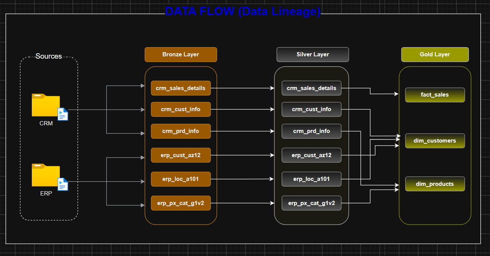
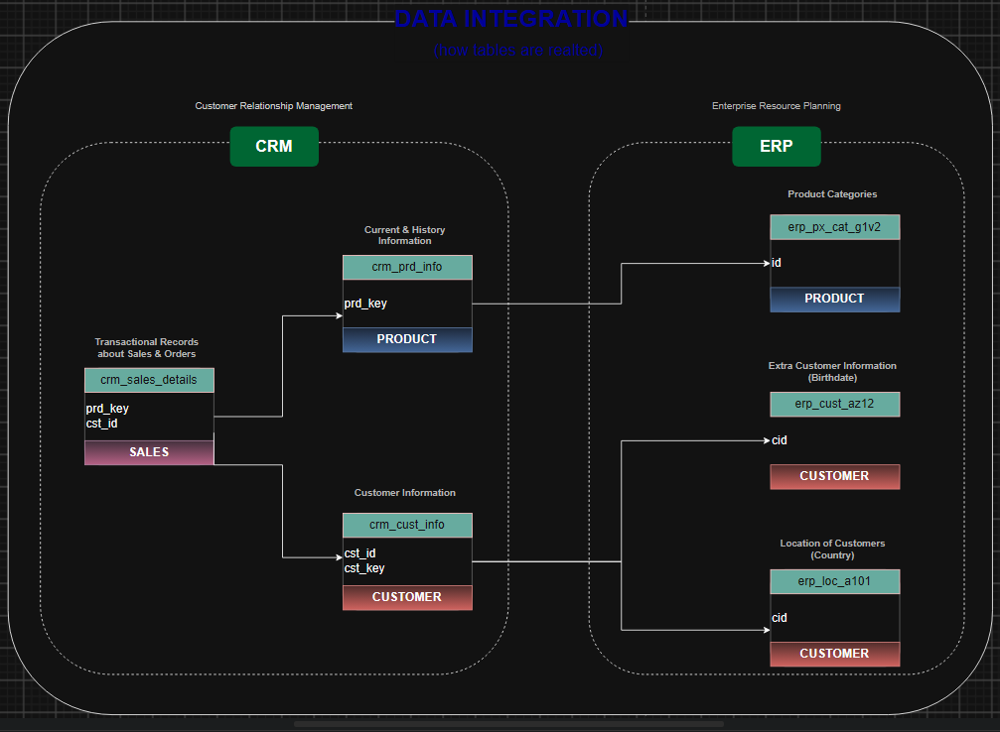
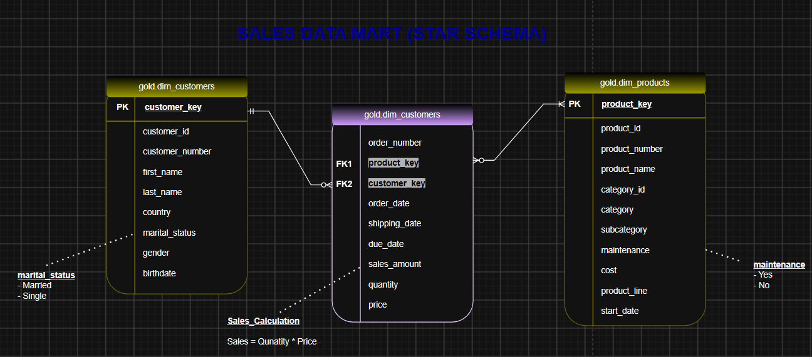

# 🏗️ SQL Data Warehouse Project

A complete end-to-end **SQL Data Warehouse** project built using **SQL Server** following the **Medallion Architecture (Bronze, Silver, and Gold Layers)**.

The project extracts data from CRM and ERP source systems, transforms it into a clean and standardized format, and builds a business-ready dimensional model (Star Schema) for reporting and analytics.

---

# 📖 Project Overview

This project demonstrates how to build a modern Data Warehouse using SQL Server by implementing ETL pipelines and dimensional modeling.

The warehouse integrates multiple source systems, applies data cleaning and transformation, and provides business-ready data for reporting, dashboards, and analytics.

---

# 🎯 Project Objectives

- Build a scalable SQL Data Warehouse.
- Integrate CRM and ERP data sources.
- Implement Bronze, Silver, and Gold layers.
- Clean and standardize raw data.
- Create a Star Schema for analytics.
- Produce business-ready datasets for BI and reporting.

---

# 🛠️ Tech Stack

- Microsoft SQL Server
- T-SQL
- SQL Server Management Studio (SSMS)
- Data Warehousing
- ETL Pipeline
- Dimensional Modeling
- Git & GitHub

---

# 📂 Project Structure

```
dataWarehouse/
│
├── source_crm/
│   ├── cust_info.csv
│   ├── prd_info.csv
│   └── sales_details.csv
│
├── source_erp/
│   ├── CUST_AZ12.csv
│   ├── LOC_A101.csv
│   └── PX_CAT_G1V2.csv
│
├── docs/
│   ├── data_architecture.png
│   ├── data_flow.png
│   ├── data_integration.png
│   ├── data_model.png
│   └── data_catalog.md
│
├── scripts/
│   ├── init_database.sql
│   │
│   ├── bronze/
│   ├── silver/
│   └── gold/
│
└── README.md
```

---

# 🏛️ High Level Architecture

The warehouse follows the Medallion Architecture.



### Bronze Layer
- Stores raw data from CRM and ERP systems.
- Full load using batch processing.
- No transformations are applied.
- Data is stored exactly as received.

### Silver Layer
- Cleans and standardizes data.
- Removes duplicates.
- Handles missing values.
- Performs normalization.
- Creates derived columns.
- Enriches business data.

### Gold Layer
- Builds business-ready data models.
- Implements Star Schema.
- Creates Dimension and Fact tables.
- Optimized for reporting and analytics.

---

# 🔄 Data Flow (Data Lineage)

The following diagram illustrates how data flows from the source systems through each layer of the warehouse.



---

# 🔗 Data Integration

CRM and ERP datasets are integrated during the Silver Layer before being transformed into analytical tables.



---

# ⭐ Sales Data Mart (Star Schema)

The Gold Layer contains a Star Schema optimized for reporting.



## Dimension Tables

### gold.dim_customers

Contains enriched customer information including:

- Customer Details
- Country
- Gender
- Marital Status
- Birthdate

---

### gold.dim_products

Contains product information including:

- Product Name
- Category
- Subcategory
- Product Line
- Cost
- Maintenance Status

---

## Fact Table

### gold.fact_sales

Stores transactional sales data including:

- Order Number
- Customer Key
- Product Key
- Order Date
- Shipping Date
- Sales Amount
- Quantity
- Price

---

# 🔄 ETL Process

## Bronze Layer

- Import CSV files
- Full Load
- Batch Processing
- Raw Data Storage

## Silver Layer

- Data Cleaning
- Standardization
- Data Validation
- Normalization
- Data Enrichment

## Gold Layer

- Business Transformations
- Star Schema
- Aggregation
- Business Logic
- Reporting Views

---

# 📊 Data Model

| Layer | Objects |
|--------|----------|
| Bronze | Raw Tables |
| Silver | Cleaned Tables |
| Gold | Dimension Tables & Fact Table |

---

# 📈 Business Use Cases

This warehouse can be used to analyze:

- Sales Performance
- Customer Analysis
- Product Performance
- Revenue Trends
- Sales by Country
- Sales by Category
- Monthly Sales
- Product Line Performance

---

# 🚀 Future Improvements

- Incremental Data Loading
- Slowly Changing Dimensions (SCD)
- SQL Agent Automation
- Power BI Dashboard
- Data Quality Monitoring
- Performance Optimization

---

# 📄 Documentation

Additional project documentation is available in the **docs** folder.

- Data Architecture
- Data Flow
- Data Integration
- Data Model
- Data Catalog

---

# 👩‍💻 Author

**Muskan Saini**

GitHub: **muskan-saini27**

Aspiring Data Analyst | SQL Developer | Data Warehouse Developer

---

⭐ If you found this project helpful, please consider giving it a Star!
